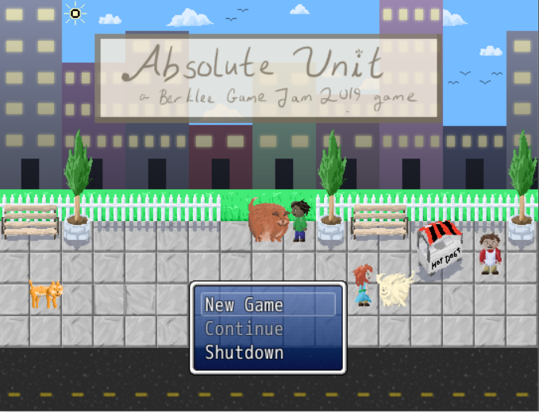
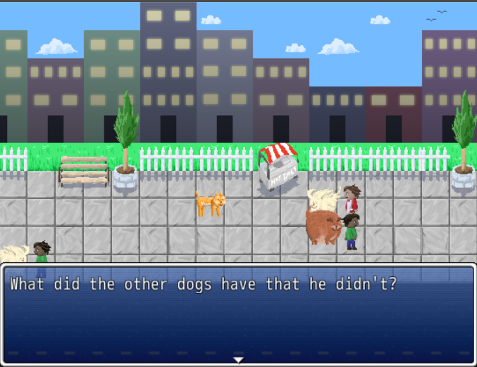
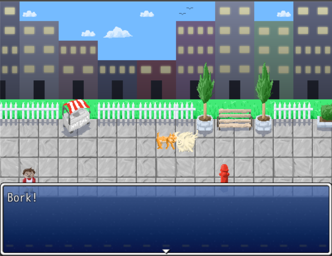
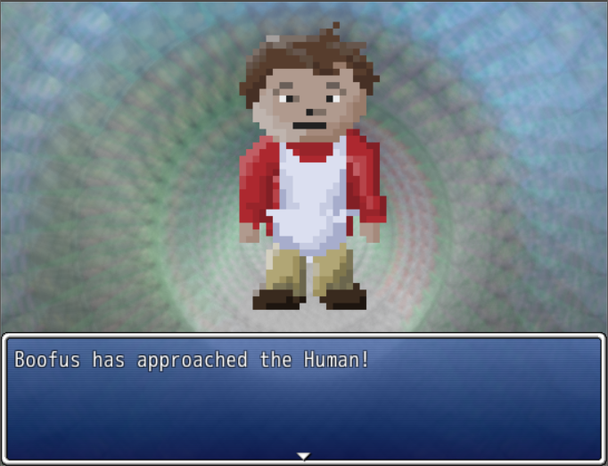

### About the Game

Absolute Unit is a game about a skinny dog named Boofas, who doesn't have an owner. He sees that all the other happy dogs with their owners are a little chubby. He decides to embark on a quest to get all the treats to become an absolute unit, and get an owner. Beg for treats, make friends, and become the biggest boy.

Absolute Unit was made in less than 48 hours during a game jam hosted by Berklee College. Since there was only one programmer the team decided to use RPG Maker. This allowed me to more easily import the art and music, while also focusing on the design and programming of the game.

### Contributions

- Imported audio and art assets
- Balanced encounters
- Wrote dialogue and flavor text
- Created the world layout (using the artist's assets) and character interactions

### What I Learned

As an avid Unity user, this is one of the few games I've made that uses RPG maker instead! Since I was the only one with programming experience on the team, we decided to use an engine that required less programming. This worked in our favor since then I only had to worry about implementing assets ((which boils down to dropping a file in a folder, then selecting it in engine)), and writing the dialogue.

### Screenshots

| 

     | 

    |
| ------------------------------------ | ----------------------------------- |
|    |   |
|  |  |
