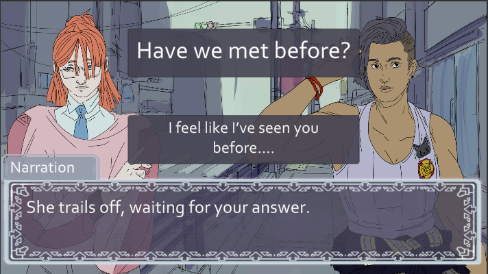
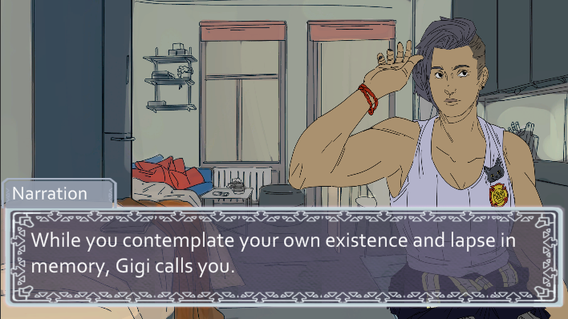
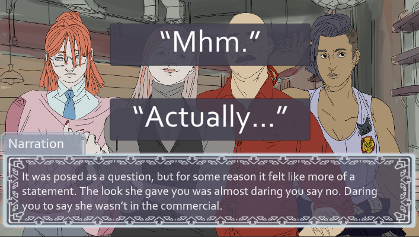
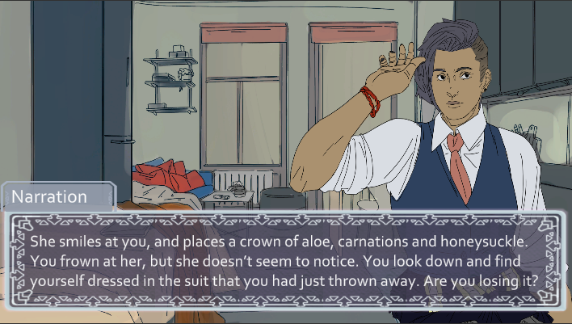

### About the Game

Date N' Dash is a visual novel about a firefighter named Lyla, who somehow gets stuck in a time loop. Every new loop is slightly different, except for one thing: a cute girl named Gigi.

Date N' Dash was made to answer the question: "What if a dating sim, but every time you died it got _faster?"_ This led the team to creating a fun, Groundhog Day-esc dating sim. The team managed to finish the game before the end of the jam with a script that was 69 pages long, eleven different music tracks and even some voice acting!

### Contributions

- Wrote and deigned for a branching narrative
- Collaborated with another writer to come up with a cohesive design
- Wrote the narrative for days two, three and the intro of five
- Wrote the narrative for two of four possible endings
- Translated the script to work with the Ink Plugin for Unity

### What I Learned

This game was really fun to make! It was my first time in a long time writing a dating sim. Throughout the week, the other writer and I stayed in contact through Discord while we wrote on the same Google Doc. At the start of the jam we had a long call about the structure of the narrative, how much branching we wanted, then divvied up how we were going to write each day of the script. We decided on five days and four endings to split between us, and to keep each day linear with minor branching to give the illusion of choice. We would leave comments on the other's writing as we went to give feedback.

It was an interesting way to write, but ended up leaving us with some inconsistencies in writing style. Generally, we both had a similar writing style, but small things like narration style or small character quirks would be inconsistent across the days. We would go back through to fix these inconsistencies, but not all of them were caught.

### Screenshots

| 

  | 

 |
| --------------------------------- | -------------------------------- |
|    |   |
|  |  |
