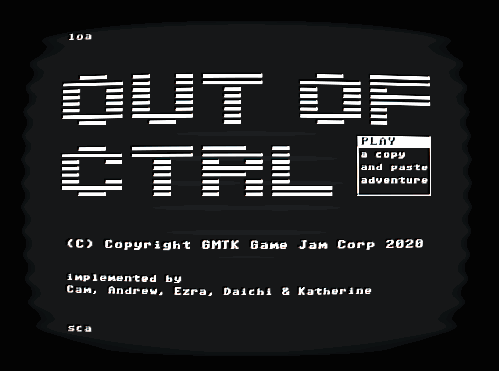

### About the Game

Have a conversation with an old computer that seems to know more about you than it should. While the computer can type whatever it wants, the only way you can respond is by copy and pasting pieces of the text from previous parts of the conversation.

Out of CTRL was made for the 2020 Game Maker's Toolkit (GMTK) Jam. It was rated **#19 in originality** and **#251 overall** out of _**5,357 total entries.**_ Since release, it has amassed over **6,000 browser plays** and **10k views,** as well as being played on Twitch by streamers. This is currently a demo, and the team is currently working a version that is more responsive to the player!

### Contributions

- Wrote all dialogue and text
- Designed dialogue in a way that responses to the player made sense without the need for context
- Planned out overall narrative pacing
- Directed a voice actor on how to portray the character

### What I Learned

Part way into the GMTK Game Jam, a jam I had been on the fence about joining, a friend messaged me asking to do some writing on a small project. After hearing the pitch I *had* to work on it. This was my first project where I worked as the only writer and designer, and had no hand in the coding. I wrote the original script in about eight hours.

As fun as this project was, it was very difficult to write for. Previously, I had mostly written visual novels or Twine games. I was used to branching paths, but in all those games, you know what the other person will respond with. In Out of CTRL, the user could say anything with the words they have access to. With every line I wrote, I had to also account for what the user would say in response, and make sure the computer's response would make sense in most cases.

### Screenshots

| 

  |
| ------------------------------- |
|  |
|  |
