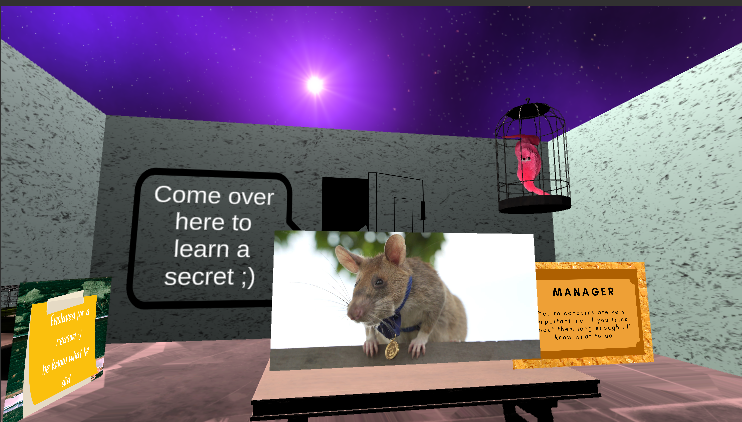
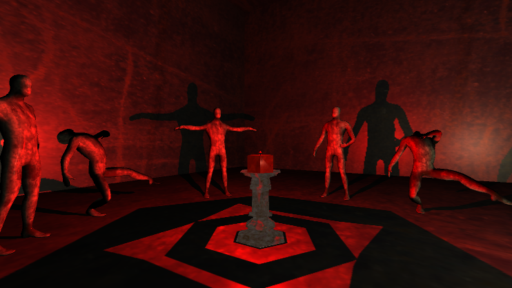
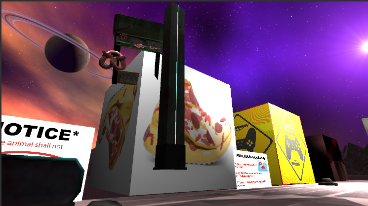
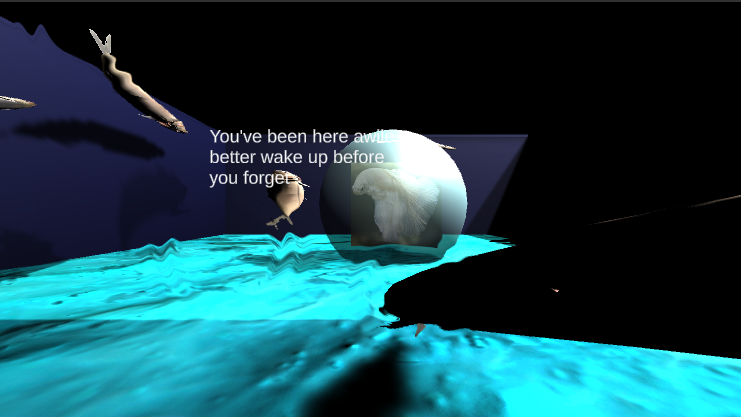

### About the Game

THEMALL is a short expereince about being lost in a mall.

This was made for Global Game Jam 2021! A bit ago there were pictures floating around of a "weird mall", so the team decied to recreate it. THEMALL is less of a game, and just an experience of stores and sounds. Each store has it's own music track, and occationally fully voiced announments are made!

### Contributions

- Lead a team of designers and artists
- Implemented most of the art and rooms
- Wrote all voice lines
- Created moodboards to help team to understand the vibes

### What I Learned

This game is one of my favourites that I have ever made. The motto that the team and I had while creating it was "No form. Only Vibes.", which basically meant that we had little plans going into the design outside of what we wanted the player to feel. We spent a day brainstorming what different stores could be by creating moodboards and finding weird or surreal images online, before settling on a few and getting to work. We used a combination of 2D and 3D art assets that we either made or found for free online.

### Screenshots

| 

  | 

 |
| --------------------------------- | -------------------------------- |
|    |   |
|  |  |
